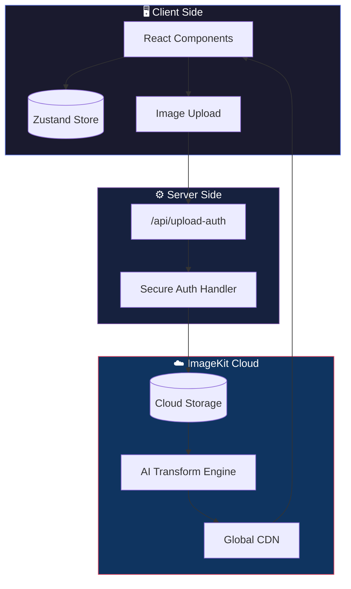

<h1 align="center">
  <span style="font-size: 2.5rem;">PixEdit</span>
</h1>

<p align="center">
  <strong>🎨 AI-Powered Image Transformation Studio</strong>
  <br/>
  <em>Transform, enhance, and reimagine your images with cutting-edge AI technology</em>
</p>

<p align="center">
  
  
  
  
  
</p>

---

## ✨ What is PixEdit?

**PixEdit** is a next-generation, browser-based image editing platform that brings professional-grade transformations to your fingertips. Powered by **ImageKit's AI engine** and built with **Next.js 15**, it delivers lightning-fast, non-destructive edits without requiring any software installation.

> [!TIP]
> **No downloads. No plugins. Just pure creativity.**
> Open your browser, upload an image, and start transforming!

---

## 🚀 Core Features

### 🖼️ **Smart Image Upload**
Upload images directly from your device with real-time progress tracking. Our secure authentication flow ensures your files are protected during transit.


---

### ✂️ **Resize & Crop Studio**
| Feature | Description |
|---------|-------------|
| **Aspect Ratios** | 1:1, 4:3, 16:9, 9:16, and custom ratios |
| **Crop Modes** | Maintain ratio, pad-resize, extract, maintain at-least/at-max |
| **Smart Focus** | Automatically center on faces, objects, or custom coordinates |
| **DPR Scaling** | Device pixel ratio adjustments for retina displays |

---

### 🎭 **Overlay & Watermarking**
Add text overlays, watermarks, and layered compositions with precision control:

- 📝 **Dynamic Text Layers** — Add titles, captions, or branding
- 🎨 **Custom Positioning** — Pixel-perfect placement control
- 🔲 **Blend Modes** — Multiply, overlay, screen, and more
- ✨ **Visual Effects** — Shadows, glows, and transparency

---

### 🤖 **AI-Powered Transformations**

> [!IMPORTANT]
> These features leverage ImageKit's advanced AI capabilities for stunning results.

| Transformation | What It Does |
|----------------|--------------|
| **🪄 Background Removal** | Instantly isolate subjects with one click |
| **🎨 Background Change** | Replace backgrounds with colors or images |
| **🖌️ Generative Fill** | AI-powered content-aware fill for expansion |
| **✏️ AI Editing** | Natural language-based image modifications |

---

### 🌟 **Effects & Enhancements**

Transform ordinary photos into extraordinary art:

```
┌─────────────────────────────────────────────────────────────┐
│  🔵 Blur Control      [░░░░░░░████████░░░░░░░]   35%       │
│  ✨ Sharpen           [░░░░░░░░░░██████████░░]   65%       │
│  🎚️ Contrast          [░░░░░██████████░░░░░░░]   50%       │
│  ⬛ Grayscale         [░░░░░░░░░░░░░░░░░░░░░█]  100%       │
└─────────────────────────────────────────────────────────────┘
```

---

## 🏗️ Architecture



---

## 🛠️ How It Works

### 1️⃣ **Secure Upload Flow**
```typescript
// Client requests secure upload credentials
const authParams = await fetch("/api/upload-auth");
const { token, signature, expire } = authParams;

// Upload with authenticated parameters
await upload({ file, token, signature, expire });
```

### 2️⃣ **URL-Based Transformations**
All edits are applied via ImageKit's transformation URL syntax:
```
https://ik.imagekit.io/your_id/image.jpg?tr=w-800,h-600,fo-auto,e-grayscale
                                          └───────┬────────────────────────┘
                                              Transformation Parameters
```

### 3️⃣ **Real-Time Preview**
Transformations preview instantly in the browser. No server round-trips needed for previewing changes!

---

## 📁 Project Structure

```
nextjsimagekit/
├── 📂 src/
│   ├── 📂 app/
│   │   ├── 📄 page.tsx           # Main editor interface
│   │   ├── 📂 api/upload-auth/   # Secure auth endpoint
│   │   └── 📂 my-edits/          # Saved transformations
│   │
│   ├── 📂 myComponents/
│   │   ├── 🎨 ResizeCropEditBar     # Resize/crop controls
│   │   ├── 🎭 OverlayEditBar        # Text & layer overlays
│   │   ├── 🤖 AiTransformationEditBar # AI features
│   │   └── ✨ EffectsEnhancementsEditBar # Effects panel
│   │
│   ├── 📂 zustandStore/           # Global state management
│   └── 📂 utilityFunctions/       # Transform URL builders
│
└── 📄 package.json                # Dependencies & scripts
```

---

## 🎯 Key Technologies

| Technology | Purpose |
|------------|---------|
| **Next.js 15** | App Router, Server Components, API Routes |
| **React 19** | Latest React with concurrent features |
| **ImageKit** | Cloud storage, transformations, and CDN |
| **Zustand** | Lightweight, fast state management |
| **Tailwind CSS v4** | Utility-first styling with new features |
| **Radix UI** | Accessible, unstyled UI primitives |
| **TypeScript** | Type-safe development experience |

---

## 🔒 Security First

> [!CAUTION]
> Your private keys are **never exposed** to the client.

- 🔐 **Server-Side Auth** — Private keys remain on the server
- ⏰ **Expiring Tokens** — Upload credentials have time limits
- ✅ **Signature Verification** — All uploads are cryptographically signed
- 🚫 **No Client Exposure** — API keys never reach the browser

---

## 🚀 Getting Started

```bash
# 1. Clone and navigate
cd nextjsimagekit

# 2. Install dependencies
npm install

# 3. Configure environment
# Create .env.local with your ImageKit credentials

# 4. Launch development server
npm run dev
```

Open [http://localhost:3000](http://localhost:3000) and start creating! 🎨

---

## 💾 Save Your Work

All your transformations are automatically saved to **localStorage**, so you can revisit your edits anytime from the **My Edits** page.

---

## 🌐 Deployment

Deploy to Vercel with one click:

[](https://vercel.com/new)

**Required Environment Variables:**
- `IMAGEKIT_PRIVATE_KEY`
- `IMAGEKIT_PUBLIC_KEY`  
- `IMAGEKIT_URL_ENDPOINT`

---

## 📖 Resources

| Resource | Link |
|----------|------|
| 📘 ImageKit Documentation | [docs.imagekit.io](https://docs.imagekit.io/) |
| 📗 Next.js Documentation | [nextjs.org/docs](https://nextjs.org/docs) |
| 📙 Zustand Guide | [github.com/pmndrs/zustand](https://github.com/pmndrs/zustand) |
| 📕 Tailwind CSS v4 | [tailwindcss.com](https://tailwindcss.com/) |

---

<p align="center">
  <strong>Built with ❤️ using Next.js, ImageKit, and AI</strong>
  <br/>
  <sub>© 2026 PixEdit — Transform Your Vision</sub>
</p>

---

<p align="center">
  
  
  
</p>
